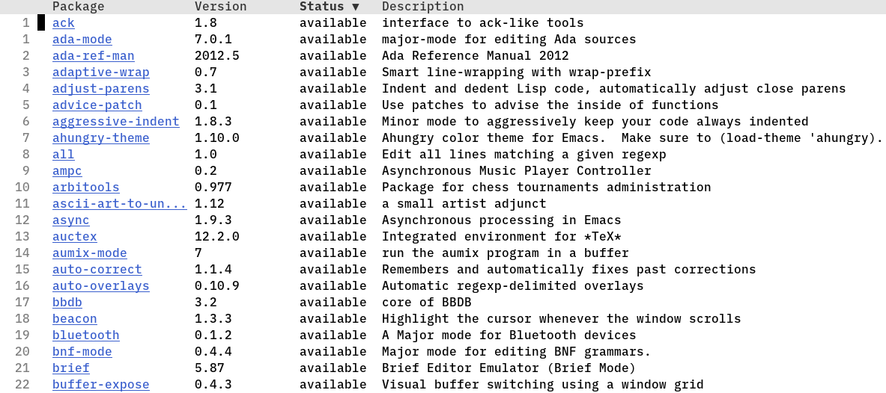

Table of contents
=================

-   [Package installation](#package-installation)
-   [What is a package?](#what-is-a-package)
-   [Installing a package with
      package.el](#installing-a-package-with-packageel)
-   [MELPA](#melpa)
    -   [Using MELPA](#using-melpa)
-   [Installing packages
      programmatically](#installing-packages-programmatically)
-   [use-package, straight.el, Borg, Quelpa, Cask,
    el-get](#use-package-straightel-borg-quelpa-cask-el-get)

Package installation
====================

In this chapter I want to talk about package installation and
management. Since version 24 Emacs has a builtin package manager,
`package.el`. There are multiple ways of installing packages, some of
which I will only mention and others which I will focus a bit on. But
let\'s start with the definition of a package and the default way of
installing one.

What is a package?
==================

A package is nothing but one or multiple Elisp files which extend or
change the functionality of Emacs.

There are two types of packages, a `simple package` and a
`multi-file package`. The first is just a single Emacs Lisp file, the
latter is a conglomerate of multiple Emacs Lisp and non-Lisp files
stored inside a tar archive.

When installing a package, Emacs creates a sub-directory under
`package-user-dir`, which by default is called `elpa`, for the newly
installed package, where its name is `$packagename-$version`. This is
the package\'s content directory, i.e. where Emacs stores the Elisp
file(s) which form the package.

Installing a package with package.el
====================================

Let\'s say we want to install the `ace-window` package, which makes it
easier to navigate between multiple windows. By typing
`M-x list-packages` we can see all available packages in the `ELPA`,
which stands for `Emacs Lisp Package Archive`. This is the official
package repository that comes with Emacs per default.

So after typing said command, one will see something like that:

By moving the cursor to the package one wants to install and pressing
`i`, said package will be marked for installation, which can be started
by pressing `x` (you can uninstall a package the same way by pressing
`d` instead of `i`).

This will create the following directory structure inside
`~/.emacs.d/elpa/`:

    .
    ├── ace-window-0.9.0
    │   ├── ace-window-autoloads.el
    │   ├── ace-window.el
    │   ├── ace-window.elc
    │   └── ace-window-pkg.el
    ├── ace-window-0.9.0.signed
    ├── archives
    │   └── gnu
    │       ├── archive-contents
    │       └── archive-contents.signed
    ├── avy-0.5.0
    │   ├── avy-autoloads.el
    │   ├── avy.el
    │   ├── avy.elc
    │   ├── avy-pkg.el
    │   ├── avy-pkg.elc
    │   ├── avy-test.el
    │   ├── avy-test.elc
    │   ├── ChangeLog
    │   ├── doc
    │   │   └── Changelog.org
    │   ├── Makefile
    │   ├── README.md
    │   └── targets
    │       ├── avy-init.el
    │       ├── avy-init.elc
    │       ├── checkdoc.el
    │       └── checkdoc.elc
    ├── avy-0.5.0.signed
    └── gnupg
        ├── private-keys-v1.d
        ├── pubring.kbx
        ├── pubring.kbx~
        └── trustdb.gpg

Notice that besides me only marking `ace-window` for installation, the
package tells `package.el` about its dependency on `avy` which it then
installs, too.

As you can see, the installed `ace-window` has its own directory named
after the aforementioned syntax of `$packagename-$version`, which in
this case is `ace-window-0.9.0`. Inside this directory, they are the
Emacs Lisp files `.el` which Emacs then compiles into `.elc` files.

The directory also contains `ace-window-autoloads.el` and
`ace-window-pkg.el`. The `autoloads` feature is a really nifty thing, in
my opinion. What it does is it tells Emacs about the functions (or
macros) of the installed package and the file(s) where they actually
reside in. This greatly enhances the startup of Emacs because it does
not load the files until they are needed to actually provide the
functions they contain.

Just to be clear, though: I am greatly simplifying `autoloads` and the
benefits they provide, mostly because at this point I do not fully
understand how they work and because of my self-imposed restrictions of
not over-researching a topic I will keep myself from doing just that.

The `ace-window-pkg.el` file just describes the package itself, names
its author, and the like.

The rest of the files and directories are the signed package hashes, the
public key of the archive we are using and the corresponding database
for storing those.

Notice that after installing `ace-window` or any other package, there
will be the following code blocks in your config file:

    ;; Added by Package.el.  This must come before configurations of
    ;; installed packages.  Don't delete this line.  If you don't want it,
    ;; just comment it out by adding a semicolon to the start of the line.
    ;; You may delete these explanatory comments.
    (package-initialize)

    (custom-set-variables
     ;; custom-set-variables was added by Custom.
     ;; If you edit it by hand, you could mess it up, so be careful.
     ;; Your init file should contain only one such instance.
     ;; If there is more than one, they won't work right.
     '(package-selected-packages (quote (ace-window))))
    (custom-set-faces
     ;; custom-set-faces was added by Custom.
     ;; If you edit it by hand, you could mess it up, so be careful.
     ;; Your init file should contain only one such instance.
     ;; If there is more than one, they won't work right.
     )

At startup, after loading the init file, the `(package-initialize)`
function initializes Emacs\' internal record of installed packages, and
loads their `autoloads` - if they are in the `package-load-list` - which
by default every installed package is.

The second part with `custom-set-variables` are entries which will be
created by the `customize` interface. This is for handling dependencies
on package deletions and is also intended to make your configuration
portable. I do not like Emacs to write into my config file. Because of
that, I move these entries to another file `~/.emacs.d/custom.el` and
tell Emacs where to find them.

    (setq custom-file "~/.emacs.d/custom.el")
    (load custom-file)

MELPA
=====

The `ELPA` might be the official archive, but the number of packages in
it are pretty limited and, most of the time, the packages themselves are
outdated. This is because of the strict regulations the `ELPA`
maintainers enforce on package creators.

Because of that, the `MELPA`, or
`Milkypostman's Emacs Lisp Package Archive` is the de facto standard
repository for Emacs.

It is not officially supported by the GNU project, but it is curated and
one can be sure that the packages do not contain malicious code. Still,
you should still take care when installing a lesser-known package!

Using MELPA
-----------

In order to use `MELPA`, you need to put the following code block into
your config file:

    (require 'package)
    (let* ((no-ssl (and (memq system-type '(windows-nt ms-dos))
                        (not (gnutls-available-p))))
           (proto (if no-ssl "http" "https")))
      (add-to-list 'package-archives (cons "melpa" (concat proto "://melpa.org/packages/")) t))
    (package-initialize)

Let\'s see what that does.

The (require \'package) line tells Emacs to fully load the builtin
package `'package`, but only when not already loaded. This is opposed to
using `load`, which would load the files even already loaded. To let
Emacs know which package provides the `'package` feature, inside the
package itself there must be a line like `provide 'package`.

The `'package` package provides the package installation and management
system of Emacs.

The next code block just makes sure that when the system is a Windows
system it should not use `HTTPS` to access the repository. I am not
going to fully explain what the code exactly does and - of course - this
is not mandatory if you are not on a Windows system or are planning to
use your config on one.

The `add-to-list` part adds the `MELPA` url to the `'package-archives`
`alist`.

After that, the package record will be initialized.

Now, after typing `M-x package-list` you can see that there are a lot
more packages available for installation. When you do not see the new
entries you have to refresh the package list via
`M-x package-refresh-contents`.

Installing packages programmatically
====================================

Like stated before there is another option to install packages other
than using `M-x list-packages`. To install e.g. `which-key`, a package
which \'displays the key bindings following your currently entered
incomplete command (a prefix) in a popup\' - [as the developer describes
it](https://github.com/justbur/emacs-which-key) - I put the following
code into my config:

    (package-install 'which-key)
    (which-key-mode)

When Emacs starts up, it will try to install `which-key` and after
either doing so or realizing that it is already installed it will
activate `which-key-mode` globally. This makes your config portable so
that when you are keeping it in version control you just have to copy
your config onto the new system and it will install all the packages you
list.

Of course this is not the most sophisticated way, but it works. And
after I have dug a bit more into Elisp programming I might reevaluate
this approach. But for now, this should suffice. I am aware, though,
that this might not scale as the number of installed packages increases.

use-package, straight.el, Borg, Quelpa, Cask, el-get
====================================================

Like I initially said, there are a lot of ways to install packages in
Emacs. Mostly these are \'external\' package managers or installers that
one has to install first.

I will only mention them here, as I want to get into the nitty-gritty
and follow the \'official\' way of doing things with the builtin
features. By doing so I hope, in the future, I will be able to
objectively decide on which alternative package manager or installer I
want to use (yes, I know: `use-package` is not a package manager).

Also know that there might be a lot more than the few I mention in the
heading, but those are the most known - to me at least.
