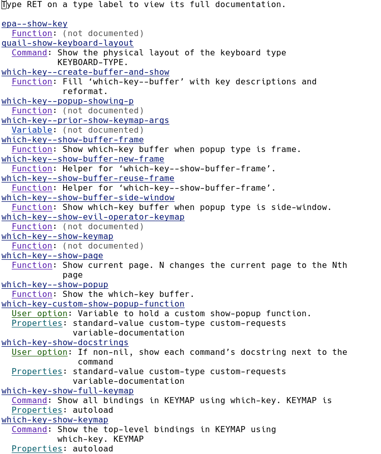

Table of contents
=================

-   [On using documentation](#on-using-documentation)
-   [The builtin manual](#the-builtin-manual)
-   [Looking up variables, functions, symbols and much
    more](#looking-up-variables-functions-symbols-and-much-more)
-   [Apropos](#apropos)

On using documentation
======================

Emacs calls itself an \'extensible, self-documenting\' editor. I guess
at this point we figured out why it calls itself extensible but I did
not talk that much about the \'self-documenting\' part. Shamefully so,
because the documentation and manuals provided with, and even accessible
from within, Emacs is really impressive. On top of that I think knowing
how to read and use documentation is a key skill everyone should have.

More that I am willing to admit I find myself looking things up via
search engine and reading completely outdated information instead of
just consulting the official documentation. I understand that sometimes
the documentation is hard to search in but with Emacs this is not the
case.

The builtin manual
==================

First off: All commands regarding any form of help have the prefix
`C-h`.

To show the builtin Emacs manual for your specific version, press
`C-h r`. This is the same manual one would see when going to the [Emacs
website](https://www.gnu.org/software/emacs/manual/html_mono/emacs.html).

You can use normal Emacs movement key chords in here and press `RET` on
a link (manual topic) to follow it. To get back to the parent topic you
can press `o`. To go to the last shown page press `l`.

But, of course, this is not the fancy \'self-documenting\'
functionality I am talking about. There is so much more!

Looking up variables, functions, symbols and much more
======================================================

When you are once again deep inside an `init.el` on GitHub and want to
know what all these variables the creator of said config is using for
customization, you can press `C-h v` to look up the definition of that
variable, same for functions (`C-h f`) and symbols (`C-h S`).

But again, there is more! Let\'s say you forgot what exactly a specific
variable inside your config does, you can move to it and then press
`C-h v`. Emacs will then suggest the variable under point.

To see all possible things you can look up, press `C-h ?`. This will
open a list of options in a new buffer.

But to give you some example of what you can look up with these
commands, I will provide more examples:

When you know or heard about a specific command but don\'t know which
key cord invokes it, you can simply use `C-h w` and Emacs will tell you.
On the contrary, there is `C-h c` which shows you the command invoked by
the given key sequence of which you get the full documentation of when
using `C-h k`.

If you want to know more about a specific package, is it builtin or
external, you can search for it with `C-h i` which brings you to the
documentation browser. In here you can find documentation on all the
packages, Emacs basics, and much more. Also, whenever you install a
package from `(M)ELPA` which brings a manual it places this manual
inside a file called `dir`. The path to this file is then added to the
variable `Info-directory-list`. The browser then adds all these `dir`
files to the top of the info page. Sadly, it seems that only a small
number of packages actually include a `dir` file.

With `C-h m` you get the documentation of the current minor modes and
major mode. This is really helpful, especially if you installed a
package which does not provide a `dir` file like explained above. In
here you can find out about all the key bindings inherent to the current
major/minor mode(s).

Apropos
=======

But what if you don\'t actually know what you are looking for? What if
you can only describe what you want? There is a command for that:
`Apropos`.

With `M-x apropos` you have a full-text search at your disposal to
search for words, lists of words or even regular expressions. It will
find any (interactive) function or variable matching your search query
and will show you a list of all matches in a new buffer - which is in
the `Apropos` major mode.

You can use different variations of the apropos command to narrow the
search. There are `apropos-command`, `apropos-documentation`,
`apropos-mode`, `apropos-library` and a few others.

To show off a bit what we have learned by now, let\'s assume we know
there is a package that shows possible keys after typing a key chord,
but we don\'t know what its name is. So we type
`M-x apropos RET show key`.

You will see something like that:

Right, it\'s `which-key`! We found the package we were looking for
without searching the internet and hoping to find the answer we were
looking for in a 5 year old reddit thread or something (okay, in the
case of `which-key` it would be not that hard, but still).

Now, just out of curiosity let\'s see what we can do in the `Apropos`
major mode. We learned that one can get info about the current modes by
pressing `C-h m`. This will look something like that:

Frankly, there is not that much we can do in here, but it also tells us
that when starting the `Apropos` major mode, it runs the
`apropos-mode-hook`. This makes it possible to activate specific minor
modes or set a variable just in this mode.

This might not be that helpful in `Apropos`, but there are also hooks
for e.g. `prog-mode`, a specific mode that activates whenever Emacs
opens a \'programming buffer\'. Here I for example start `hl-line-mode`,
which highlights the current line and `display-line-numbers-mode`, which
shows the current line number and all the other lines relatively to it.
I also want Emacs to show matching parentheses when point is near it. I
don\'t want these modes inside \'prose-writing buffer\', so I only
activate it when I am coding.

This is the code block I am using for that:

    (add-hook 'prog-mode-hook
              (lambda ()
                (hl-line-mode t)
                (show-paren-mode 1)
                (setq display-line-numbers-type 'relative)
                (display-line-numbers-mode 1)))

I know this derailed a bit, but I wanted to show you that when exploring
something in Emacs you can find out about a totally different function
or variable you did not know about before. And all this inside Emacs!
You also think that\'s great, right?
